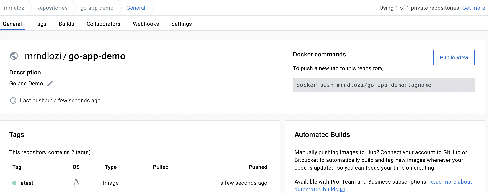
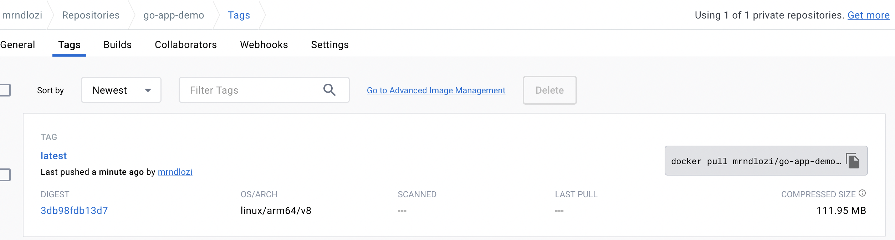
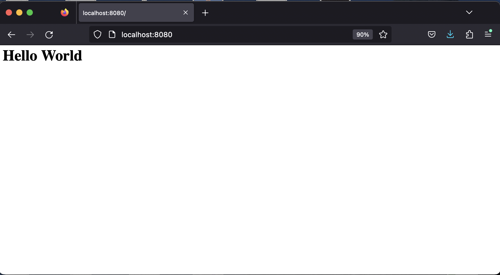

# Hello World - Golang App.

## Instructions

> Provide a README file in text or markdown format that provides a concise way to setup and run
the provided solution.
Take the time to read any applicable API or service docs, it may save you significant effort
Make your solution simple and clear. We aren't looking for overly complex ways to solve the
problem since in our experience simple, clear solutions to problems are also generally the most
maintainable and extensible solutions.

Provide your solution in a zip or compressed tar archive.

## Working on the Minikube task.

Write a simple hello world application in any one of these languages: Python, Ruby, `Go`. Build the application within a Docker container and then load balance the application within minikube.
You are not required to automate the installation of minikube on the host machine.

### Choose to use Golang.


**Let's get started!**

### Pre-reqs

A list of tools that you may require to run this simple project.

1. docker
2. minikube
3. text editor (VS Code)
4. 

### Write a simple hello world app.

Using two main packages:

- **`"fmt"`** : fmt is a Go package that is used to format basic strings, values, inputs, and outputs. It can also be used to print and write from the terminal.
- **`"net/http"`** : The net/http package not only includes the ability to make HTTP requests, but also provides an HTTP server you can use to handle those requests.

**Golang app:**

`main.go`

```go
package main

import (
	"fmt"
	"net/http"
)

func hw_page(w http.ResponseWriter, r *http.Request) {
	fmt.Fprintf(w, "<h1>Hello World</h1>")
}

func main() {
	http.HandleFunc("/", hw_page)
	http.ListenAndServe(":3000", nil)
}
```

Now that we have the app, we have some packageing to do. We need to bake our golang app into a docker image.

`Dockerfile`

```dockerfile
# syntax=docker/dockerfile:1

FROM golang:alpine
LABEL maintainer="Sandile"

# Create destination for COPY
RUN mkdir /app

# Set destination for COPY
WORKDIR /app
COPY main.go /app

# Download Go modules
COPY go.mod /app
RUN go mod download

# Build
RUN CGO_ENABLED=0 GOOS=linux go build -o /helloworld
# RUN go build -o helloworld .
CMD ["/helloworld"]
```

**Build docker image**

```bash
$ docker build -t go-app-demo .
[+] Building 301.7s (14/14) FINISHED
 => [internal] load .dockerignore
 => => transferring context: 2B
 => [internal] load build definition from Dockerfile
 => => transferring dockerfile: 400B
 => resolve image config for docker.io/docker/dockerfile:1
 => docker-image://docker.io/docker/dockerfile:1@sha256:39b85bbfa7536a5feceb7372a0817649ecb2724562a38360f4d6a7782a409b14
 => => resolve docker.io/docker/dockerfile:1@sha256:39b85bbfa7536a5feceb7372a0817649ecb2724562a38360f4d6a7782a409b14
 => => sha256:39b85bbfa7536a5feceb7372a0817649ecb2724562a38360f4d6a7782a409b14 8.40kB / 8.40kB
 => => sha256:7f44e51970d0422c2cbff3b20b6b5ef861f6244c396a06e1a96f7aa4fa83a4e6 482B / 482B
 => => sha256:a28edb2041b8f23c38382d8be273f0239f51ff1f510f98bccc8d0e7f42249e97 2.90kB / 2.90kB
 => => sha256:9d0cd65540a143ce38aa0be7c5e9efeed30d3580d03667f107cd76354f2bee65 10.82MB / 10.82MB
 => => extracting sha256:9d0cd65540a143ce38aa0be7c5e9efeed30d3580d03667f107cd76354f2bee65
 => [internal] load metadata for docker.io/library/golang:alpine
 => [internal] load build context
 => => transferring context: 54B
 => [1/7] FROM docker.io/library/golang:alpine@sha256:fd9d9d7194ec40a9a6ae89fcaef3e47c47de7746dd5848ab5343695dbbd09f8c
 => => resolve docker.io/library/golang:alpine@sha256:fd9d9d7194ec40a9a6ae89fcaef3e47c47de7746dd5848ab5343695dbbd09f8c
 => => sha256:fd9d9d7194ec40a9a6ae89fcaef3e47c47de7746dd5848ab5343695dbbd09f8c 1.65kB / 1.65kB
 => => sha256:78fe86fd14b4806a66f6325e5eb00954baffbb2f233771431dce5191ca13ab08 1.16kB / 1.16kB
 => => sha256:19a250fba0a7d71ff407cfdc5a2669bf54bd5da6c59e27200681b5ffe4e6f502 5.12kB / 5.12kB
 => => sha256:8c6d1654570f041603f4cef49c320c8f6f3e401324913009d92a19132cbf1ac0 3.33MB / 3.33MB
 => => sha256:5a768fa670f57b0faf1a0a8cb211432ed97307628729fa53e3ea9981ba7512d4 286.29kB / 286.29kB
 => => sha256:04e93037748df9b60559b897102d67352180f07a12cbbaba3c4e9d2f55358c0c 96.08MB / 96.08MB
 => => sha256:3bb6809feae6840b6f39626e494885e6e3669032920bbd16d82957d71a7f41bb 155B / 155B
 => => extracting sha256:8c6d1654570f041603f4cef49c320c8f6f3e401324913009d92a19132cbf1ac0
 => => extracting sha256:5a768fa670f57b0faf1a0a8cb211432ed97307628729fa53e3ea9981ba7512d4
 => => extracting sha256:04e93037748df9b60559b897102d67352180f07a12cbbaba3c4e9d2f55358c0c
 => => extracting sha256:3bb6809feae6840b6f39626e494885e6e3669032920bbd16d82957d71a7f41bb
 => [2/7] RUN mkdir /app
 => [3/7] WORKDIR /app
 => [4/7] COPY main.go /app
 => [5/7] COPY go.mod /app
 => [6/7] RUN go mod download
 => [7/7] RUN CGO_ENABLED=0 GOOS=linux go build -o /helloworld
 => exporting to image
 => => exporting layers
 => => writing image sha256:8a72cdbb105aa1b59d769369ce527c8757f47a05eeac9cba1bc180e9ec9582c7
 => => naming to docker.io/library/go-app-demo  
```

Now that we have built the docker image, let's test the app by running a docker container on our local.

```bash
$ docker run -d -p 8080:3000 --name go-app-cont go-app-demo
bf3052254931cb3c37c15811ee4fc4705112a33ba26bce14788d88c8dd193b08

$ docker ps
CONTAINER ID   IMAGE           COMMAND          CREATED          STATUS             PORTS                      NAMES
bf3052254931   go-app-demo     "/helloworld"    5 minutes ago    Up 5 minutes       0.0.0.0:8080->3000/tcp     go-app-cont
```

Login to your docker repository. This is interactive.

```bash
$ docker login
Login with your Docker ID to push and pull images from Docker Hub. If you don't have a Docker ID, head over to https://hub.docker.com to create one.
Username: <insert your username>     
Password: <insert your password> 
Login Succeeded
```

Tag the image and push it to dockerhub.

```bash
$ docker tag go-app-demo mrndlozi/go-app-demo:latest
$ dacoker images
REPOSITORY                                TAG               IMAGE ID       CREATED          SIZE
mrndlozi/go-app-demo                      v0.1.0            8a72cdbb105a   10 minutes ago   317MB

$ docker push mrndlozi/go-app-demo:latest
The push refers to repository [docker.io/mrndlozi/go-app-demo]
ee1b33b2ef10: Pushed 
d13937ee1bbf: Pushed 
9669487c8230: Pushed 
12bdbe97a0ac: Pushed 
5f70bf18a086: Mounted from sickcodes/docker-osx 
be1f75fb3099: Pushed 
71633fa7a6f6: Mounted from library/golang 
c95d4b89b09e: Mounted from library/golang 
f728c2448cfe: Mounted from library/golang 
61f2871f545a: Mounted from library/golang 
v0.1.0: digest: sha256:3db98fdb13d7bb31d5aa39390d414e2adf7f9bf136af725c10bb6104d90a7597 size: 2402
```
**Dockerhub view**




### Deploy to minikube cluster

```yml
apiVersion: apps/v1
kind: Deployment
metadata:
  name: my-go-app-demo
spec:
  replicas: 1
  selector:
    matchLabels:
      app: go-app-demo
  template:
    metadata:
      labels:
        app: go-app-demo
    spec:
      containers:
      - name: go-app-container
        image: mrndlozi/go-app-demo
        resources:
          limits:
            memory: "128Mi"
            cpu: "500m"
        ports:
        - containerPort: 3000
```

```bash
# Check if there are deployments available.
$ kubectl get deployments
No resources found in default namespace

# Create a deployment
$ kubectl create -f deployment.yaml
deployment.apps/my-go-app-demo created

# Check if your deployment went through successfully
$ kubectl get deployments
NAME             READY   UP-TO-DATE   AVAILABLE   AGE
my-go-app-demo   1/1     1            1           3m44s

# Check if you can get pods.
$ kubectl get pods
NAME                              READY   STATUS    RESTARTS   AGE
my-go-app-demo-77b94f794f-4tk48   1/1     Running   0          4m8s
```

In order for us now to get to the application via the browser, we have to expose it via the service.

`service.yaml`

```yml
---
apiVersion: v1
kind: Service
metadata:
  name: my-go-app-svc
spec:
  type: LoadBalancer
  ports:
  - name: my-go-app-svc
    port: 8080
    targetPort: 3000
  selector:
    name: my-go-app-demo
```

```bash
# Create a the service
$ kubectl apply -f service.yaml 
service/my-go-app-svc created

# Services of type LoadBalancer can be exposed via the minikube tunnel command. It must be run in a separate terminal window to keep the LoadBalancer running. Ctrl-C in the terminal can be used to terminate the process at which time the network routes will be cleaned up.
$ minikube tunnel
✅  Tunnel successfully started

📌  NOTE: Please do not close this terminal as this process must stay alive for the tunnel to be accessible ...

🏃  Starting tunnel for service my-go-app-svc.

# Get the services running
$ kubectl get services
NAME            TYPE           CLUSTER-IP       EXTERNAL-IP   PORT(S)          AGE
kubernetes      ClusterIP      10.96.0.1        <none>        443/TCP          4d17h
my-go-app-svc   LoadBalancer   10.101.161.252   127.0.0.1     8080:31940/TCP   9m49s
```

```bash
$ kubectl get svc my-go-app-svc -o yaml
```
```yml
apiVersion: v1
kind: Service
metadata:
  annotations:
    kubectl.kubernetes.io/last-applied-configuration: |
      {"apiVersion":"v1","kind":"Service","metadata":{"annotations":{},"name":"my-go-app-svc","namespace":"default"},"spec":{"ports":[{"name":"my-go-app-svc","port":8080,"targetPort":3000}],"selector":{"name":"my-go-app-demo"},"type":"LoadBalancer"}}
  creationTimestamp: "2023-06-18T17:25:48Z"
  name: my-go-app-svc
  namespace: default
  resourceVersion: "97809"
  uid: d85dab2c-8f90-4e74-8c0c-63e9107ff4e7
spec:
  allocateLoadBalancerNodePorts: true
  clusterIP: 10.101.161.252
  clusterIPs:
  - 10.101.161.252
  externalTrafficPolicy: Cluster
  internalTrafficPolicy: Cluster
  ipFamilies:
  - IPv4
  ipFamilyPolicy: SingleStack
  ports:
  - name: my-go-app-svc
    nodePort: 31940
    port: 8080
    protocol: TCP
    targetPort: 3000
  selector:
    name: my-go-app-demo
  sessionAffinity: None
  type: LoadBalancer
status:
  loadBalancer:
    ingress:
    - ip: 127.0.0.1
```

Access the app via the browser ([localhost:8080](http:localhost:8080))

